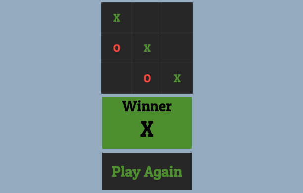

### Tic-tac-toe

> This game is created with html, css and jquery

### A Game For Two

A game in which two players seek in alternate turns to complete a row, a column, or a diagonal with either three O's or three X's drawn in the spaces of a grid of nine squares; noughts and crosses.

### Design

### `Demo`

Here you can play the game in the browser:
[Demo Version](https://jquery-game-five.vercel.app/)

## `Tech Stack`

- HTML
- CSS
- JS
- jQuery
- Vercel
- Git Workflow

## `Project setup`

1. Clone this repository.
2. To run the app in development mode `npx serve`, then open http://localhost:5000 to view it in the browser.
